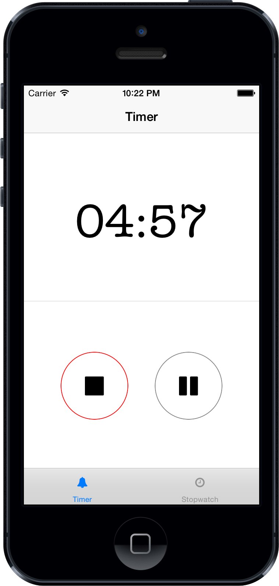
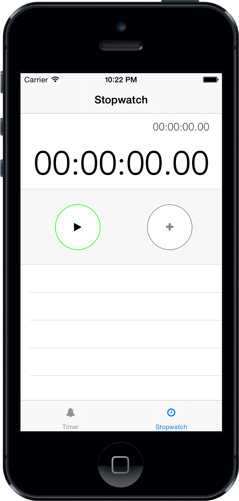
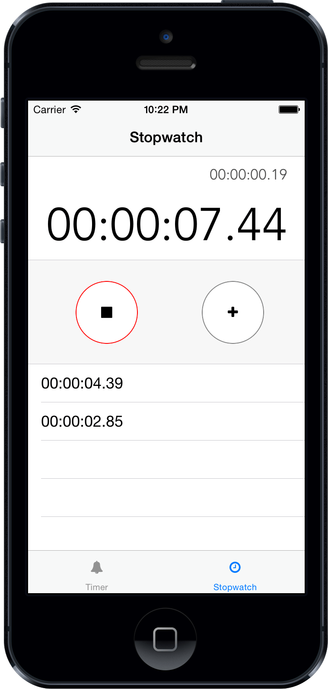

Timer
------------
 + Timer in x minutes/hours with alarm. Similar to Apple's Timer App.
 + Start, Stop, Pause, Resume
 + NSTimer, Concurrency, UILocalNotification, NSTimeInterval, UIDatePicker

_

AlarmClock
-------------
 + Laps, Timetracking
 + Nested UITableView
 + UITrackingRunLoopMode

_

Requirements
------------
requires cocoapods, build with

    $ pod install 
